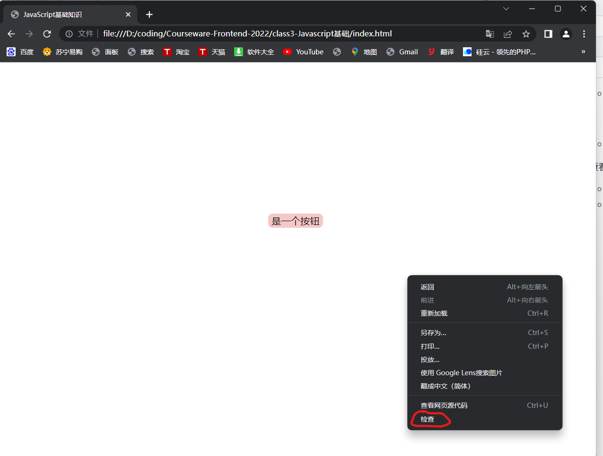

# JavaScript语法基础知识        ——林培灿

## 
### **一、复习回顾HTML、CSS，Javasripts引入**
#### 1.1 一个基本HTML、CSS页面
  - <head> <body> <foot>  <style> <meta> <link>
#### 1.2 实现页面的功能
  - 输入 <button>    <button>   
  - 输出 控制台、DOM 
### **二、JavaScript基础背景知识储备**
#### 2.1 JavaScript介绍
- JavaScript是什么？
  - JavaScript是一种浏览器**脚本语言**，是一种运行在浏览器中的**解释型的、弱类型的**编程语言。诞生之初是专门为浏览器环境设计，但是现在也广泛地运用在各种场景下。
  - Java和JavaScript的关系:取名为JavaScript最初是网景(navigator开发商)希望能借Java名气作推广，实际**二者毫不相干**...emmm
- JavaScript有什么用？
  - 在Web设计时,如果只能把图片、文本等元素贴在页面上,那页面就是一张大号的静态海报，显然，这种效果并不理想。
  - JS的在元素和数据之间架起了桥梁，通过变量、常量等的数据变化，使在页面上可以有实现交互。
  - JS的运用可以嵌入**动态文本**让页面有丰富的变化,借助JS还可以实现**动画/3D等**效果
- JavaScript和编译类语言的区别？   
    - 相信大部分同学或多或少都已经学习了一定的C语言基础，学习JS和学习C语言的方法类似,**记忆语法,多动手实践操作**。C语言是一种典型的编译类语言，需要使用gcc编译库对自然语言(待编译文件.c)处理成机器语言(可执行文件.exe)才能够运行。JS则不需要,JS是脚本语言,可以**实时**将高级语言转为机器语言**自动执行**。
    - 相比**HTML和CSS**来说,可以真的称得上是在**编程**,HTML和CSS是**标记语言**,而JS具有**逻辑性**、有编程语言的**函数**、**IPO结构**等,学好JS是成为前端程序猿**必要前提**。
  
  [【文章推荐: JavaScript的语言基本特点】](https://www.php.cn/js-tutorial-477720.html)
#### 2.2 JavaScript的构成及代码规范
- JavaScript的[组成](https://www.cnblogs.com/Shyno/p/15262099.html)

   一个完整的 JavaScript 实现由以下 3 个不同部分组成：
    - 核心（**ECMAScript**）：语言核心部分，描述了该语言的语法和基本对象。

    - 文档对象模型（Document Object Model，**DOM**）：网页文档操作标准，描述处理网页内容的方法和接口。

    - 浏览器对象模型（**BOM**）：客户端和浏览器窗口操作基础，描述与浏览器进行交互的方法和接口。
    
- JavaScript代码规范
  - 关于ES6
    - ES 的全称是 ECMAScript , 它是由 ECMA 国际标准化组织,制定的一项脚本语言的标准化规范。每一次标准的诞生都意味着语言的完善，功能的加强。
  - 初学JS为什么从ES6开始
    - ES6中引入了对变量、常量、作用域等解释,利用**变量提升***(弱类型)特性可以有丰富的运用,语法不严格。
    - 从一开始就规范编程,可以避免后期的**踩坑**,以及**代码质量**难以提高。


#### 2.3 用什么**参考书**
  - 犀牛书-《JavaScript——The Definitive Guide》
  
       
  - 红宝书——《JavaScript高级程序设计 第4版》版本越新越好
  
      
  - 吃透这两本书你就是JS大佬了。

同学们都急不可耐地想开始编程了吧，下面开始正式实操干货。

### **三、JavaScript保姆教学**
#### 3.1 引入一个JS程序的三种方法

- 1.外部引入(&#x2728;推荐)
```
<script type="text/javascript" src="路径/文件名.js"></script>
```
  - 如在与html文件同一文件夹下面创建一个.js格式文件,任意命名。例"first.js"
  - 那么引入
    `<script type="text/javascript" src="./first.js"></script> `
  - 如果script标签外部引入js文件，那么此标签当中就不能再写js程序
  
`*注:为了方便教学,课堂将使用外引式教学`

- 2.内部引入
```
<script type="text/javascript">
    //js代码
    alert('js hello world!');//弹窗
</script>
```
- 3.行内引入
```
<input type="button" value="行内引入方式" onclick="javascript:alert('蓝山学前端');">
```
<input type="button" value="行内引入方式" onclick="javascript:alert('蓝山学前端');">

- 附: 外引式代码框架:
  - HTML文件 index.html
    ```
        <!DOCTYPE html>
          <html lang="en">
              <head>
                  <meta charset="UTF-8">
                  <meta http-equiv="X-UA-Compatible" content="IE=edge">
                  <meta name="viewport" content="width=device-width, initial-scale=1.0">
                  <title>JavaScript基础知识</title>
              </head>
              <body>
                  <div>
                    <input class="btn-1" type="button" value="行内引入方式" onclick="fn()";>
                  </div>
              </body>
          </html>
           <script type="text/javascript" src="./first.js"></script>
    ```
  - CSS文件 index.css
    ```
        .body{
          width:100%;
          height:100%;
          margin:25% 25%;
          background-color:#efefef
        }
        .btn-1{
          width:"3rem";
          border:none;
          border-radius:8px;
          background-color:#012eef
        }
        
    ```
  - JS文件 first.js
    ``` 
      function fn(){
       console.log("来蓝山找灿灿学前端！");
    }
    ```
  -  
#### 3.2 执行第一个JS程序
  - 页面事件(event)
       - 发生在html标签元素上的事情 
       - 一般通过事件的触发让html元素和js函数建起联系，也叫**事件绑定函数**
       - 几个常见的事件:

|   事件名  |   执行含义  |参数约定|
| :------:| :----: | :----: |
| onclick |  鼠标点击事件 | event.target(点击事件源元素) |
| onmouseover |  光标移动到元素上方时 |event.clientX(横坐标) event.clientY(纵坐标) |
| onmouseout |  光标移出元素上方时 |event.clientX(横坐标) event.clientY(纵坐标) |
| onkeydown |  键盘按键按下事件 |key:键位编号 |
| onkeyup |  键盘按键松开事件 |key:键位编号 |
| onfocus |  输入框获取焦点事件 |event.clientX(横坐标) event.clientY(纵坐标)|
| onblur | 输入框失去焦点事件 |event.clientX(横坐标) event.clientY(纵坐标)|
| onstroll | 文档被滚动时 |————|

- Console 对象
  |   控制台方法  |   执行含义  |参数约定|
  | :------:| :----: | :----: |
  | log() |  控制台输出一条信息 | Number String Object Array |
  | clear() | 清空控制台 | ——  |
  | warn() | 控制台输出警告 | ——  |
  | assert() | 断言(断言为false打印err)) | Boolean  |
  | count() | 调用次数计数器 | Number  |
  - 例子
    ```
      console.log("来蓝山找灿灿学前端!")
    ```
  - **提问: 对象？**

- 查看控制台:
  - 在浏览器打开HTML文件,"右键"——>"检查" 或者 F12打开控制台
  - Edge
    - ①

    
   
    - ②
 
        
  - Chrome
    - ①
  
        
    - ②
     
        

    - 调试器按键简介:
  
        
  - 点击按钮运行第一个js程序:

       
 
#### 3.3 Javascript 的语法规则特点
  - 3.3.1 句末分号
      JS并不想C语言等编译类语言需要严格地使用分号来表征换行,句末分号可以省略。在初学阶段,为了易于理解语句逻辑,**推荐将分号带上**。
  - 3.3.2 大小写与中英文
     - 在JS中一切的命名(标识符)、关键字和操作符等,都是区分大小写的,比如:
  ```
    function OpenDoor(){
        console.log("OpenDoor")
    }
    function opendoor(){
        console.log("opendoor")
    }  
  ```
   当调用OpenDoor,只会执行第一个函数,因此可以利用区分大小写的特性对标识符的命名进行规范化命名。

  - 3.3.2 严格模式
    ```
     'use strict';
    ```
  - 3.3.3 规范化标识符  
    - 驼峰法
      - 每一个单词为单位,每一个新单词,eg. `nameList`
    - 下划线法
      - 单词统一使用小写,单词之间用下划线连接,eg. `name_list` 
  - 3.3.4 注释
      ```  
           //	单行注释
            /*
              多行注释
            */
      ```
  - 3.3.5 函数 
    - 普通函数(关键字function)  
     ```
        function 函数名(参数名1,参数名2,...){
          return 参数名1;//返回值 可有可无
        }
      ```
    - 箭头函数(ES6以后的语法)  
     ```
      //匿名函数写法
        (参数名1,参数名2,...)=>{
          return 参数名1;//返回值 可有可无
        }
      //可以将函数赋给一个常量
      const fn = (参数名1,参数名2,...)=>{
          return 参数名1;//返回值 可有可无
        }
      ```
 #### 3.4 ES6中标识符初始化
  -  3.4.1 作用域(scope)
       - 作用域包括全局(global)与局部(part)两种
         - 全局作用域在页面打开时创建，页面关闭时销毁
         - 局部作用域是在函数内创建的作用域,函数执行完毕,局部作用域会销毁
      ```
          var num = 10;
          function nu(){
          var num = 20;
          console.log(num);   
          }
         nu();
         console.log(num); 
      ```
  -  3.4.2 var
       - 用于声明一个可变变量,因为是“弱类型”声明,该变量可以赋为任意值。var 声明初始化可以在分离也可以同时完成,但是要注意的是,在未赋值时,变量默认为undefined。
       ```
          var a; 
          console.log(a) //undefined
          a = "1";
          var b = "2";
          console.log(a,b)  //1 2
          var c = 3;
          console.log(a + c) //13
          console.log(c + a) //4
       ```    
       - var 的变量提升
         - 以var为界以下到结束,为var声明变量的作用域,但函数体会自动提升到作用域顶层,变量可以先于声明语句调用。
          ```
              ()=>{
                console.log(b)
                var b = 2;
              }
          ```
  -  3.4.3 let
      - let的用法与var很接近,初学只需要记得三点区别
        - var声明范围是**函数作用域**， 而let声明的范围是**块级作用域**
           ```
             if(true){
                var name = 'LanMei';
                console.log (name);  //LanMei
             }
              console.log (name);  //LanMei
              if(true){
                  let birth = 1010;
                  console.log (birth);  //1010
              }
              console.log (birth);  //Uncaught ReferenceError: birth is not defined
           ``` 
        - 全局作用域下,var变量会指向window,而let变量只会指向变量本身
           ```
             var name = 'LanMei';
               let birth = 1010;
               console.log(window.name)            //LanMei
               console.log(window.birth)           //undefined
               console.log(birth)               //1010
            ```
        - var可以重复声明同一变量,但是let不能
          ```
              let birth = 1010;
              let birth = 1030;
              console.log (birth);  //Uncaught SyntaxError: Identifier 'birth' has already been declared
              var name = 'LanMei';
              var name = 'HongMei';
              var name = 'HuangMei';
              console.log (name);  //HuangMei
          ```  
          若一定要用let,也可以使用如下写法:
           ```
           ()=>{
            let birth = 1010;
            console.log(birth)
            }
           let birth = 1030;   
           console.log(birth)
          ```    
  -  3.4.4 const
     -  const 声明一个常量,常量不可修改,即无法被重新赋值,并且常量声明时**必须初始化**。
        ```
          const birth = 1010;
          birth = 1030;/Uncaught TypeError: Assignment to constant variable.
           const name;//Uncaught SyntaxError: Missing initializer in const declaration
         ```
 #### 3.5 Javascript 六大基本数据类型
  -  3.5.1 Number
     - 数值型
       - JS不像C/C++、Java、Python等语言严格区分出浮点型和整型,JS会根据声明情况及运算调整精度位,浮点数和整数都归入数值型数据。
     - 创建一个数值型
          ``` 
              a = new Number()
              console.log(a)
               console.log(typeof(a))
              b = 1
              a = 2.333
                console.log(a)
                console.log(b)
              console.log(typeof(b))
          ```
        但是,ES标准有一个最大最小范围的限制。ECMAScript中最大最小的数分别保存在Number.MAX_VALUE和Number.MIN_VALUE中，这个值为**±Math.pow(2, 53)**。在ES10规定新基本数据类型Bigint诞生后,这个范围得到拓展。
  -  3.5.2 String
        - 字符串型
          - JS中不对字符串的长度做约束,可以声明空字符串。
        - 创建一个字符串
          ``` 
            var str1 = " "
             console.log(typeof(str1)) //null
            var str2 = '12356'
            console.log(typeof(str2))  //string
          ``` 
        - [字符串操作方法](https://www.w3school.com.cn/jsref/jsref_obj_string.asp) 

          eg. str1 = "123876"  str2 = "3345866"
          |   方法名  |   执行含义  |实例用法|结果|
          | :------:| :----: | :----: |:----: |
          | indexOf(x) |  返回x在字符串里的位置 | str1.indexOf('1') | 0 |
          | lastIndexOf(x) |  返回最后一个x在字符串里的位置  | str2.indexOf('3') |1|
          | search() |  搜索匹配的字符串,返回第一个匹配字符串段的首字符位置 |str2.search('3')|0 |
          | slice(start,end) |  切割出下标为start到end-1的字符串 |str1.slice(1,3) | "23" |
          | slice(start) |  切割出下标从start开始到最后的字符串 |str1.slice(3) | "876" |
          | substring(a,b) |  切割出下标在a,b间的字符串(以较小的为起点) |str1.substring(3,1) | "23" |
          | substring(a) |  切割出下标从a开始到最后的字符串 |str1.substring(3) | "876" |
          | substr(start,length) | 切割出下标从a开始到长度为length的字符串  |str1.substr(3,2)| "87" |
          | replace(regexp,replacement) |  替换符合正则表达式reg的字符串为replacement |str2.replace(/3/g, "66"); |6645866 |
          | replace(substr,replacement) |  替换字符串substr为replacement |str2.replace(33, "66"); |6645866 |

  -  3.5.3 Boolean
      -  布尔型表示变量的真值,只有true和false两种状态。
      -  创建一个布尔型 
          ``` 
          var bool = true
          var beel = false
          var Bool = new Boolean()
          Bool = false;
          ```
    
  -  3.5.4 null
      -  空类型,顾名思义,没有类型指向,当赋值后,类型和传入值的类型相同。
      -  创建一个null类
         ``` 
          var hhh = null
          console.log(typeof hhh); //Object
          hhh = "hhh"
          console.log(typeof hhh)
          ```
      Null变量创建后仍会声明一个空间用于存储空对象。
  -  3.5.5 undefined
      -  创建一个undefined类型
          ```
            let hhh;
            console.log(hhh);  //undefined
          ``` 
  -  3.5.6 Object
     -  **对象成员**
         - ECMAScript中的对象是一组数据和功能的集合,集合内容可以是**键值对**也可以是**函数**。创建对象有五种方法：
            - 1.使用new操作符直接创建
               ```
                var obj = new Object()
                        //逐个添加属性(键值对)或方法
                  obj.name = 'Tom'
                  obj.age = 18
                  obj.setName = function(name){
                    this.name = name 
                  }
               ```
            - 2.使用对象字面量模式的创建
               ```  
                  var obj = {
                  name = 'Tom'
                  age = 18
                  setName: function(name){
                    this.name = name
                  }
                 }
               ```
            - 3.构造函数方式创建
               ```
                   function Person(name, age){
                          this.name = name
                          this.age = age
                          this.setName = function(name){
                            this.name = name
                          }
                        }
                    var obj1 = new Person('Tom',18)
                    var obj2 = new Person('Mike',20)
               ```
            - 4.工厂模式创建
               ```  
                  function newPerson(name,age){
                          var obj = {
                            name: name,
                            age: age,
                            setName: function(name){
                            this.name = name
                            }
                          }
                          return obj
                        }

                 var obj1 = newPerson('Tom',18)
                 var obj1 = newPerson('Mike',20)
               ```
            - 5.使用原型构造函数创建(Object.create())
               ```
                function Person(name, age){
                  this.name = name
                  this.age = age
                }
                Person.prototype.setName = function(name){
                  this.name = name
                }
                var obj1 = new Person('Tom',18)
               ```
     -  **数组(Array)**
          -  数组是一组有序的数据。数组的函数方法使得操作数组增删查改很便捷,可以实现动态操作。
          -  创建一个数组
             - 使用数组构造函数Array(),与c语言相似素组拥有下标(数组索引)。
               - 分离式
                 ```
                  var fruits = new Array(3); //创建一个长度为3的空数组
                  console.log(fruits);
                  fruit[0] = apple;      
                  fruit[1] = banana;
                  fruit[2] = pear;
                  console.log(fruits);
                 ```
                - 直接式
                  ```
                    var fruits = new Array("apple","banana"); //创建一个包含元素"apple","banana"的数组
                    console.log(fruits);
                   ```
              - 数字字面量模式创建(&#x2728;推荐)
                ````
                  var fruits = ["apple","banana"]; //创建一个包含元素"apple","banana"的数组
                  console.log(fruits);
                 ``` 
               - 使用from()方法创建模板
                  ```
                    let fruits = ["apple","banana"];
                    let cpFruits1 = Array.from(fruits);
                    let cpFruits2 = Array.from(fruits);
                    console.log(cpFruits1,cpFruits2);
                  ```
          - 数组空位
            - 使用数组字面量初始化数组时，可以使用一串逗号来创建空位。
            ```
               let arr =[,,,,,];
                  console.log(arr[0]);  //undefined
                  console.log(arr.length);  //5
            ```
          -  [数组操作方法 ](https://www.w3school.com.cn/jsref/jsref_obj_array.asp)
                ```
                 //eg. 
                  arr1 = [3,4,5,6]  arr2 = ["app","bpp","cpp"] arr3 = [0,9,2,3]
                  function multi(item){
                    return 10*item
                  }
                ```
              |   方法名  |   执行含义  |实例用法|结果|
              | :------:| :----: | :----: |:----: |
              | indexOf(x) |  返回x在数组里的位置 | str1.indexOf('3') | 0 |
              | join() | 将所有元素合并为字符串|str1.join('3') |"3456"|
              | isArray() |  判断是否为数组 |str1.isArray| true|
              | forEach(function) |  顺序遍历每个元素执行函数function|str1.forEach((item)=>console.log(item)) | 3 4 5 6 |
              |  map(function)  |  顺序遍历每个元素执行函数function后创建新的数组 |str1.map(multi)  | [30,40,50,60] |
              |  push(element) |  将元素element添加到数组的末尾 |str1.push(7)  | [3,4,5,6,7] |
              |  pop(element) |  删除最后一个元素并返回该元素 |str1.pop(7)  | [3,4,5],[6] |
              |  unshift(a,b,...) | 向数组开头添加一个或多个元素 |arr1.unshift(1,2)  |[1,2,3,4,5,6]|
              |  shift(a,b) |  删除数组开头一个或多个元素，并返回新的数组长 |arr1.shift(3,4)  |[5,6]|
              |  splice(key,len,element) |  在key位置向后插入element元素,并从key位置删除长度为len的元素  | arr2.splice(1,2,"dpp","epp") |["app","dpp","epp"] |
               |  slice(start,end) |  截取数组中从key位置到end-1的元素组成新的数组  | arr2.slice(1,2) |["cpp"] |
               |  sort() |  对数组进行排序(快速排序、ASCII值)  |arr3.sort()  |[0,2,3,9]|
               |  reverse() |  对数组中的元素按照序号进行反序 |arr3.reverse()  |[3,2,9,0]|
      
        
### **四、JavaScript程序结构设计**
   #### 4.1 JavaScript中的函数
  - 4.1.1 JS中的函数
    -  JS中的函数是一种特殊的**对象**,可以存储在Object类型数据内,也是最常用的对象。
  - 4.1.2 四种创建函数的方式  
    -  除了上文中普通函数和箭头函数外,还有函数表达式和构造函数new Function:
       -  语法：function 函数名(参数1，参数2){ 函数体 }
          ``` 
            function sum (num1,num2){
                  return num1+num2;
              }
              const res = sum(1,2);
              console.log (res);  //3
          ```
       -  语法：let/const 变量 = function(参数1，参数2){ 函数体 }
          ```
           const sum = function (num1,num2){
              return num1+num2;
          }
          const res = sum(1,2);
          console.log (res);  //3
            ```
       -  语法：let/const 变量 = (参数1，参数2)=>{ 函数体 }
         ```
          const sum = (num1,num2)=>{
              return num1+num2;
          }
          const res = sum(1,2);
          console.log (res);  //3
        ```
       -  语法：let/const 变量 = new Function(参数1，参数2,...,返回值);         (不常用,过多影响性能)
         ```
          let sum = new Function("num1","num2","return num1+num2");
            const res = sum(1,2);
            console.log (res);  //3
          ```
-  函数的属性

    - 每个函数都有两个属性，length和prototype,符合对象的要求。
    - prototype的知识前面我们已经讲过，length为函数定义的形参总数。
  
-  匿名函数
    - **语法**
      ```
         (function(){
            console.log("1") //块级作用域 存放语句
          })()
      ```
  **下面大部分内容与C语言基础类似,供大一上还没有开C语言课的专业同学学习**
   #### 4.2 顺序结构
   - 4.2.1 赋值语句 
     - 变量名 = 表达式;
     ```  
        var a, b;
        a = 1;                  //单赋值
        a = b = 1;            //传递赋值
        ({a, b} = {a: 1, b: 2});//无声明赋值
     ```
   - 4.2.2返回语句  
       - 在使用 return 语句时，函数会停止执行，并返回指定的值
       - 如果函数没有 return ，返回的值是 undefined
       - 返回值可以是六种基本数据类型,也可以是函数,但只能返回一条表达式。
     ```  
      function getMax(num1, num2) {
          return num1 > num2 ? num1 : num2;  //返回值为三目表达式
      }
        console.log(getMax(1, 2));
        console.log(getMax(11, 2));
     ```
   #### 4.3 选择结构
  - 4.3.1 if-else分支语句
    - if 语句
     ```
      if (condition) {
          当条件为 true 时执行的代码
      }
     ``` 
    - if-else语句
     ```
      if (condition)
      {
          当条件为 true 时执行的代码
      }
      else
      {
          当条件不为 true 时执行的代码
      }
     ``` 
    - if-else-else if语句
     ```
        if (condition1)
      {
          当条件1为 true 时执行的代码
      }
       if (condition2)
      {
          当条件2为 true 时执行的代码
      }
      else
      {
          当条件1、2不为 true 时执行的代码
      }
     ``` 
  - 4.3.2 switch-case分支语句
    - switch-case
     ```  
     switch(n)
        {
            case 1:
                执行代码块 1
                break;
            case 2:
                执行代码块 2
                break;
            default:
                与 case 1 和 case 2 不同时执行的代码
        }
     ``` 
  #### 4.4 循环结构
  - 4.4.1 for循环
     ```
      for (i = 0; i < 5; i++) {
           console.log("Lanshan!")
      }
     ```    
  - 4.4.2 for-in循环
     ```
      let arr = ['a', 'b', 'c']
        //使用for-in遍历获得索引序号
        for(let item in arr) {
            //打印数组索引（数组的索引就是对象的键名）
            console.log(item);  //0  //1  //2
        }
     ```
  - 4.4.3 for-of循环
     ```  
       let arr = ['a', 'b', 'c']
        //使用for-in遍历获取元素
        for(let item of arr) {
            console.log(item);  //a  //b  //c
        }
     ```
  - 4.4.4 while循环
     ```
        i = 0;
        while (i<5){
            i++;
            console.log("Lanshan!")
        }
     ```
  - 4.4.5 do-while循环
     ```
      do{  
         i++;
         console.log("Lanshan!")
      }
     while (i<5);
     ```
  - 4.4.6 break 和 continue
     ```
        i = 0;
        while (i<10){
            i++;
             if(i==2){
            continue;
          }
            else if(i==8){
              break;
            }
            console.log(i)
        }
     ```
    - break 语句用于跳出循环。
    - continue 用于跳过循环中的一个迭代。
   #### 4.5 函数递归
   - 4.5.1什么是递归：
     - 如果一个函数在内部可以调用其本身，那么这个函数就是递归函数。简单理解:函数内部自己调用自己, 这个函数就是递归函数。
     - 递归函数是一种高阶函数,后续课程会再展开。
   - 4.5.2基本结构:
     ```
      function fun(n){
             fun();
        }
        console.log(fun());  
     ```
   #### 4.6 函数嵌套
   - 4.6.1 什么是嵌套：
     - 如果一个函数在内部定义或者调用了其他函数,叫做嵌套函数,JS中允许多个函数的嵌套。
   - 4.6.2 基本结构:
     ```
        function foo() {
          var x = 1;
              function bar() {
                  var y =  x + 1;
                  console.log(y);
              }
          console.log(x);
        }

     ```
   #### 4.7 函数闭包
   - 4.7.1 什么是闭包：
     - 当一个函数的返回值是另外一个函数，而返回的那个函数如果调用了其父函数内部的其它变量，如果返回的这个函数在外部被执行，就产生了闭包
   - 4.7.2 函数闭包的特点:
     - 引用了外部的函数的作用域。
     - 可以创建私有作用域和私有变量，且不会被回收内存。
   - 4.7.3 与正常函数的区别:

     正常情况下，当一个函数调用结束后，函数内部定义的变量占用的内存会被清理掉，

      - （1）而当函数内部 存在闭包函数时，
      - （2）且在函数执行完，闭包函数在外部被使用的时候，
      那么在外部函数调用结束之后，由于闭包函数引用了外部函数的作用域，所以外部函数的作用域会一直在内存中，不会被处理掉。
   - 4.7.4 闭包的弊端:
     - 容易导致内存泄露 
   #### 4.8 JS程序设计[基本原则](https://blog.csdn.net/weixin_48723799/article/details/125042228?ops_request_misc=&request_id=&biz_id=102&utm_term=JS%E7%A8%8B%E5%BA%8F%E8%AE%BE%E8%AE%A1%E5%9F%BA%E6%9C%AC%E5%8E%9F%E5%88%99&utm_medium=distribute.pc_search_result.none-task-blog-2~all~sobaiduweb~default-1-125042228.142^v63^control_1,201^v3^add_ask,213^v2^t3_control1&spm=1018.2226.3001.4187)
- 4.8.1 单一职责原则（S）：

一个类只做一件事，一个类应该只有一个引起它修改的原因，应该只有一个职责。每一个职责都是变化的一个轴线，如果一个类有一个以上的职责，这些职责就耦合在了一起。导致脆弱的设计。例如：要实现逻辑和界面的分离

- 4.8.2 开闭原则（O）：

一个软件实体如类，模块和函数应该 对扩展开放，对修改封闭，即在程序需要进行拓展的时候，不能去修改原有的代码，实现一个热插拔的效果,应该尽可能减少闭包。

- 4.8.3 里式替换原则（L）：

子类应该可以完全替换父类。也就是说在使用继承时，只扩展新功能，不要破坏子类原有的功能。

- 4.8.4 接口隔离原则（I）：

使用多个隔离的接口，比使用单个接口要好。降低类之间的耦合度。换句话说客户端不应依赖它不需要的接口，比如一个接口在实现时，部分方法由于冗余被客户端实现，则应该将接口拆分，让实现类只需依赖自己需要的接口方法。

- 4.8.5 依赖倒置原则（D）：

细节应该依赖于抽象 ，抽象不依赖于细节。把抽象层放在程序设计的最高层，并保持稳定，程序的细节变化由低层的实现层来完成。（例如实现一个组件基类，存放组件的id、apperance等信息，具体的组件类继承基类，实现具体的UI及功能 ）

- 4.8.6 迪米特法则：

又名 [最少知道原则]，一个类不应该知道自己操作的类的细节，换言之只和朋友谈话，不和朋友的朋友谈话。

### **五、课后作业**

 #### 5.1 使用JavaScript实现冒泡排序
 #### 5.2 数据去重
    编写一个函数,实现数组中相同元素的去重,并将去重结果在控制台打印输出。
    示例:声明数组 arr = [1,2,3,4,3,4,3,5,5,6,4,1,1,]
    终端打印:[1,2,3,4,5,6]
 #### 5.3 打印九九乘法表
    使用JavaScript编写函数,在终端控制台中逐行打印如图所示的九九乘法表:

 #### 5.4 爬楼梯(JavaScript版)
   假设你正在爬楼梯。需要 n 阶你才能到达楼顶。
   每次你可以爬 1 或 2 个台阶。你有多少种不同的方法可以爬到楼顶呢？
   注意：给定 n 是一个正整数。

    示例: let n = 2;
    控制台打印: 2
    示例: let n = 3;
    控制台打印: 3
    